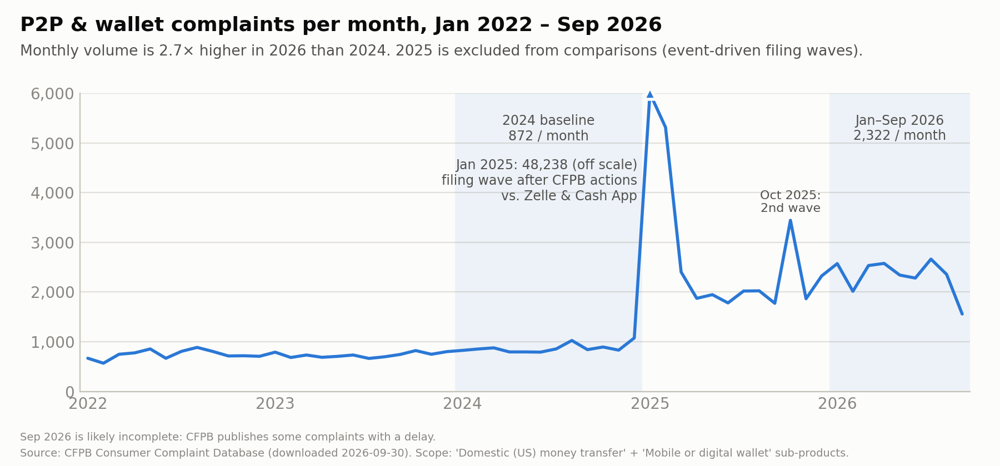
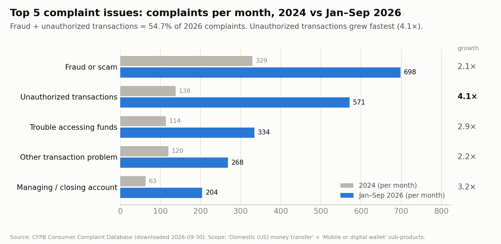
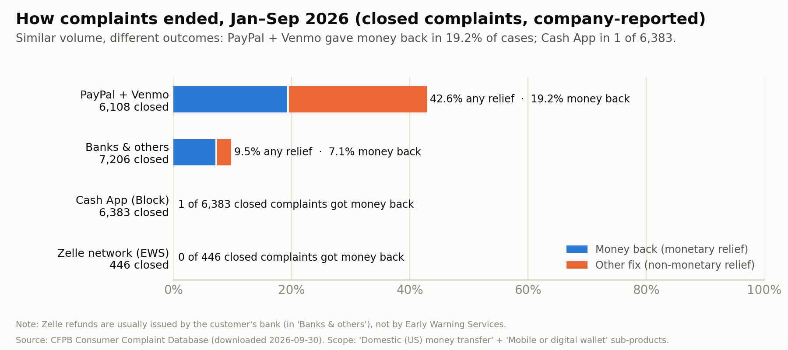

# Where P2P Payment Apps Break: A SQL Analysis of 124,087 CFPB Complaints

**Question:** Where do customers struggle most with P2P payment apps and digital wallets (Cash App, Zelle, PayPal/Venmo, banks), and what should product teams build in response?

**Answer in one line:** More than half of complaints are about money leaving an account without the customer's real consent, unauthorized transactions are the fastest-growing problem, and outcomes differ sharply by app.

📄 **[1-page insight memo (PDF)](memo/cfpb_p2p_insight_memo.pdf)** · Repo: [github.com/khushi-jha02/cfpb-payments-analysis](https://github.com/khushi-jha02/cfpb-payments-analysis)

---

## Key findings

All numbers come from the SQL in [`sql/`](sql). The main comparison is **2024 (10,461 complaints)** vs **Jan–Sep 2026 (20,894 complaints)**, measured per month so that 12 and 9 months compare fairly.

| # | Insight | Recommendation |
|---|---|---|
| 1 | **54.7%** of Jan–Sep 2026 complaints (11,428 of 20,894) were fraud/scams or unauthorized transactions (53.6% in 2024). | Risk-based "pause & confirm" before risky payments: first-time recipients, unusual amounts, new devices |
| 2 | **Unauthorized transactions grew 4.1×** (138 → 571 complaints/month), vs 2.7× for all complaints (872 → 2,322/month). | One-tap "I didn't make this": lock + dispute in one flow, real-time alerts, step-up verification |
| 3 | **Similar volume, very different outcomes.** Cash App (6,490) and PayPal + Venmo (6,341) had similar volume, but PayPal + Venmo reported money back in **19.2%** of closed complaints; Cash App in **1 of 6,383**. | In-app dispute tracker with status, timeline, decision reason and appeal path |





## Why 2025 is excluded from the comparison

January 2025 alone had **48,238** complaints (vs about 900 in a normal month). **87.2%** were filed under one vague issue ("Other transaction problem"), and **95.9%** were against Cash App (Block) or Zelle's operator (Early Warning Services). The wave coincides with two CFPB enforcement actions: the [Dec 20, 2024 lawsuit over Zelle](https://www.fortune.com/2024/12/20/cfpb-sues-jpmorgan-bank-of-america-alleged-zelle-fraud) and the [Jan 16, 2025 order against Block](https://www.consumerfinance.gov/about-us/newsroom/cfpb-orders-operator-of-cash-app-to-pay-175-million-and-fix-its-failures-on-fraud). The share of "Other transaction problem" took until about Aug 2025 to return to its normal 11–15%, and a second wave appeared in Oct 2025 (48.3%). See [`sql/03_spike_fingerprint.sql`](sql/03_spike_fingerprint.sql).

## Data

- **Source:** [CFPB Consumer Complaint Database](https://www.consumerfinance.gov/data-research/consumer-complaints/) (public domain, CC0), downloaded **Sept 30, 2026**
- **Product:** "Money transfer, virtual currency, or money service", Jan 1, 2022 to Sep 30, 2026: 156,778 complaints
- **Scope used:** sub-products "Domestic (US) money transfer" and "Mobile or digital wallet": **124,087 complaints**

The CFPB website exports at most 100,000 rows at a time, so the data comes as 3 files:

```bash
BASE='https://www.consumerfinance.gov/data-research/consumer-complaints/search/api/v1/?format=csv&no_aggs=true&product=Money%20transfer%2C%20virtual%20currency%2C%20or%20money%20service'
curl -L -o data/complaints_2022_2024.csv "$BASE&date_received_min=2022-01-01&date_received_max=2024-12-31"
curl -L -o data/complaints_2025.csv      "$BASE&date_received_min=2025-01-01&date_received_max=2025-12-31"
curl -L -o data/complaints_2026ytd.csv   "$BASE&date_received_min=2026-01-01&date_received_max=2026-09-30"
```

## How to reproduce

Requires [DuckDB](https://duckdb.org) (tested with v1.5.6).

```bash
duckdb cfpb.duckdb
.read sql/01_load_and_check.sql
.read sql/02_scope_and_spike.sql
.read sql/03_spike_fingerprint.sql
.read sql/04_top_issues.sql
.read sql/05_company_compare.sql
.read sql/06_export_results.sql
.quit
python3 charts/make_charts.py    # pip install matplotlib pillow
python3 memo/make_memo.py        # pip install reportlab
```

| File | What it does |
|---|---|
| `sql/01_load_and_check.sql` | Loads the 3 CSVs into one table; checks duplicates, date range, yearly counts |
| `sql/02_scope_and_spike.sql` | Filters to P2P/wallet sub-products; finds the Jan 2025 spike by month and day |
| `sql/03_spike_fingerprint.sql` | Compares the spike's issue mix, companies and outcomes to normal months |
| `sql/04_top_issues.sql` | Insights 1 and 2: issue shares and per-month growth, 2024 vs 2026 |
| `sql/05_company_compare.sql` | Insight 3: issue mix and relief rates by app |
| `sql/06_export_results.sql` | Saves the numbers behind each chart to `results/` |

## Caveats

- CFPB complaints are escalations by a self-selected group, not a sample of all users. The analysis therefore leans on shares and comparisons more than raw volume.
- Complaint growth may partly reflect greater awareness of the CFPB, not only more friction.
- Company responses ("Closed with monetary relief", etc.) are **company-reported**.
- Venmo is filed under "Paypal Holdings, Inc" and cannot be separated from PayPal.
- Early Warning Services (Zelle's operator) reports 0% relief because refunds usually come from the customer's bank. Zelle complaints filed against banks sit in "Banks & others".
- Dates use UTC so counts match the CFPB website. Sep 2026 is likely incomplete due to publication lag.
- Resolution rates exclude complaints still "In progress".

---
*Author: Khushi Jha, Northwestern MEM '26. Built with SQL (DuckDB), Python (matplotlib, reportlab).*
